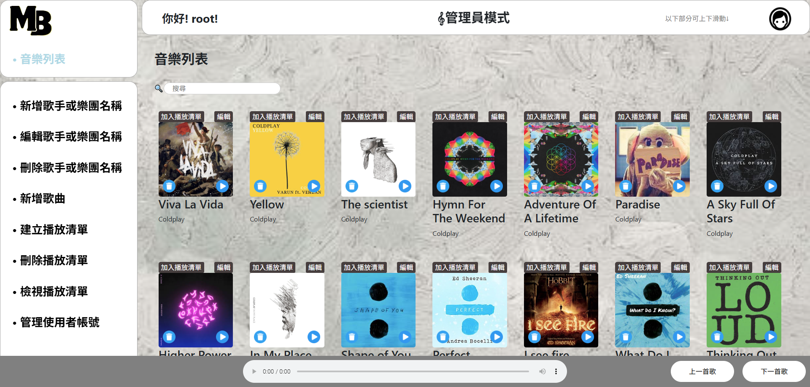
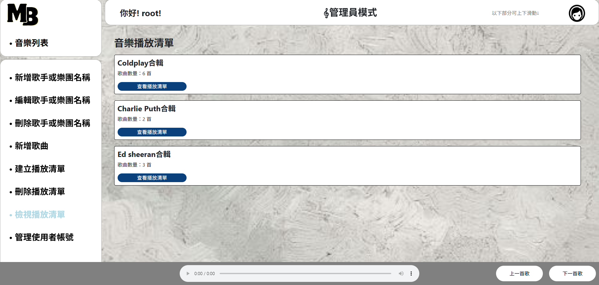
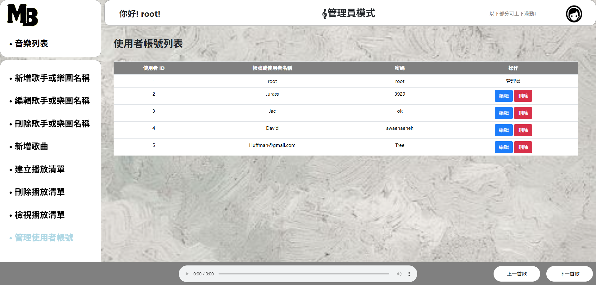

# 🎧 MBuffet - Music Playback and Playlist Management System

MBuffet is a web-based prototype music platform developed using PHP and MySQL. It features user authentication, music and playlist management interfaces, and a basic playback system. This project was developed as a coursework assignment to gain hands-on experience in full-stack development and database-driven application design.

> ⚠️ Note: All music files have been removed due to copyright concerns. Playback functionality remains for demonstration purposes only.

---

## 📸 Screenshots

📌 **Login Page**  

📌 **Main Page**  

📌 **Playlist View & Player**  

📌 **Admin Panel**  

---

## 🔧 Key Features

- User registration, login, and account management  
- Add/edit/delete songs, artists (bands), and playlists  
- View and play playlists (placeholder audio files only)  
- Separate interfaces for administrators and standard users  
- Popup windows for CRUD operations

---

## 🛠️ Tech Stack

| Layer      | Technologies           |
|------------|------------------------|
| Frontend   | HTML / CSS / JavaScript|
| Backend    | PHP                    |
| Database   | MySQL (phpMyAdmin)     |
| Dev Tools  | XAMPP                  |

---

## ⚙️ Setup Instructions

1. Install [XAMPP](https://www.apachefriends.org/)
2. Clone this repository into the `htdocs/` folder
3. Start Apache and MySQL via XAMPP Control Panel
4. Import `cbb111206.sql` into phpMyAdmin
5. Open a browser and navigate to `http://localhost/mbuffet`

---

## 🗃️ Database Schema Overview

- `accounts`: Stores user credentials and metadata  
- `songs`: Stores song metadata  
- `singers`: Artist or band information  
- `playlists`: User-created playlists  
- `playlist_songs`: Many-to-many mapping between playlists and songs

---

## 💡 Developer Notes

> This project was a valuable introduction to full-stack web development. Through building both frontend and backend components, designing the database schema, and integrating CRUD functionality, the development process significantly improved understanding of data flow, server-client interaction, and user interface implementation.

---

## 🚫 Disclaimer

- Music playback functionality is operational, but no actual audio files are included
- This project is for learning and demonstration purposes only and is not production-ready
